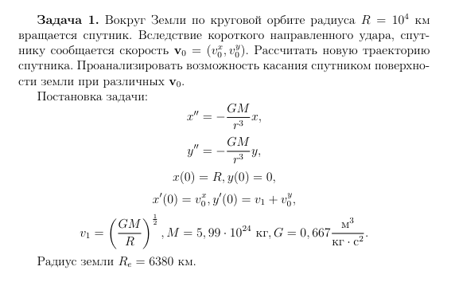
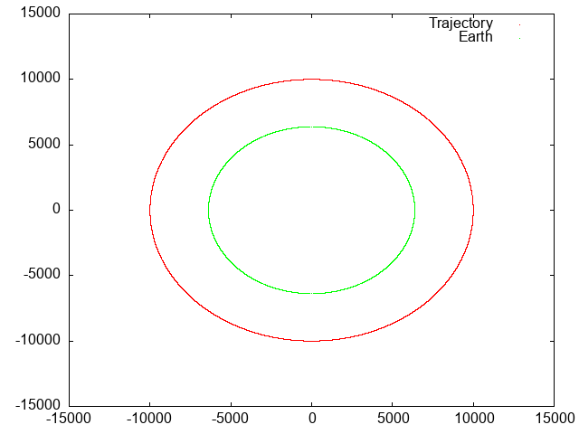
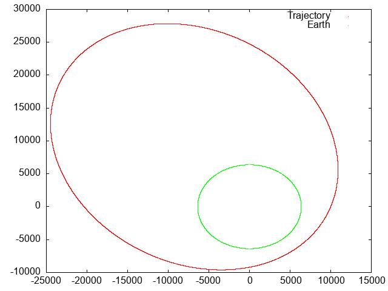
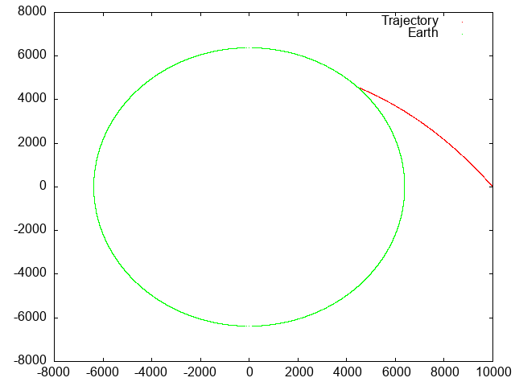
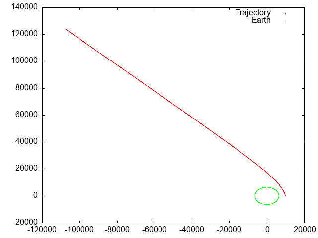

# CauchyProblem

This package implements different numerical methods for solving Cauchy problem.

### Application
This package also solves task that involves differential equations by using those numerical methods.
The task is in the 'executable/task.png' file.

Solution uses four differential equations: two for second derivative (acceleration) that are already given
and that the first derivative is the speed. We have initial values for all four equations (dx/dt, dv_x/dt, dy/dt, dv_y/dt), so
the task now becomes just a Cauchy Initial Value Problem!

In the 'executable' folder you can find executable for solving, testing and many more!
It has two command line arguments -

1. `./CauchyProblem X11` uses Linux X11 to interactively display plot of solution (works only if X11 is installed on your system).
2. `./CauchyProblem PNG filename` saves plot to file (due to absence of interactivity you may not like chosen scaling - but usually it is fine if you tweak initial values).

By default it saves plot to 'plots/plot.png' file.

There are few configurations in the executable itself - it will ask some input from you, so just follow instuctions that are given to you by the app.

#### Some examples (you can find them at 'executable/examples'):
1. `v0_x = 0, v0_y = 0` gives us simple circular orbit

2. `v0_x = 2.5, v0_y = 1` gives us elliptical orbit

3. `v0_x = -5, v0_y = 0` crashes our satellite

4. `t1 = 20000, v0_x = -3, v0_y = 5` sends our satellite on hyperbolic orbit (note how fast that is that you even have to change time to see it better on the plot!)

##### Dependencies
This package is built in Haskell by using only one library - `easyplot`, which is source of external dependency,
since it uses `gnuplot` to provide plotting API.

`gnuplot` is the only required dependency, but if you want to play with source code and compile the solution, you will need to install Haskell and install `easyplot` via `cabal`.
You will be able to find nice guidelines on how to do that in the Internet.
